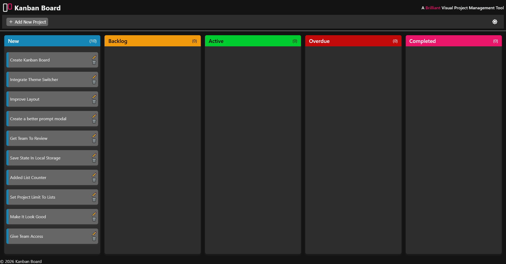
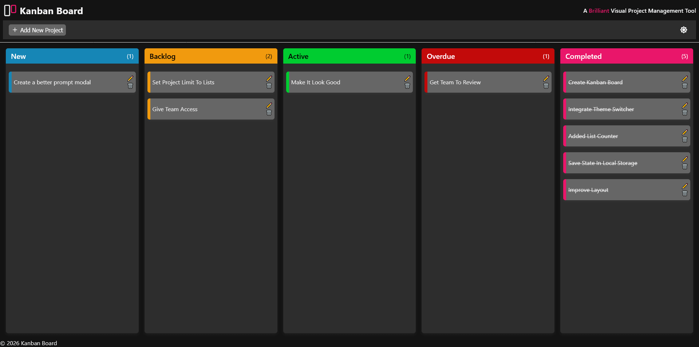
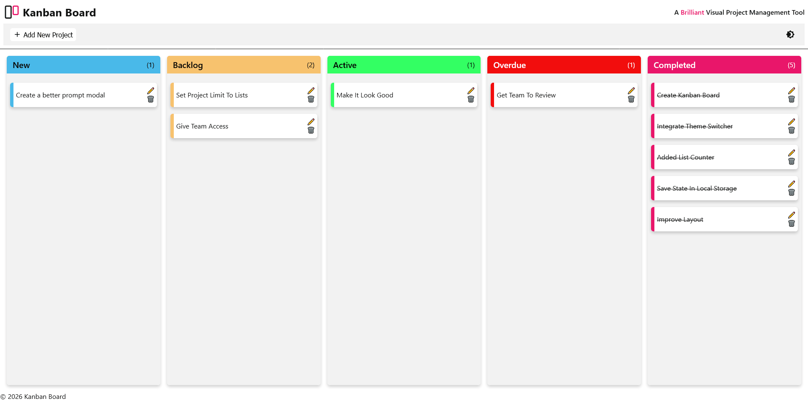
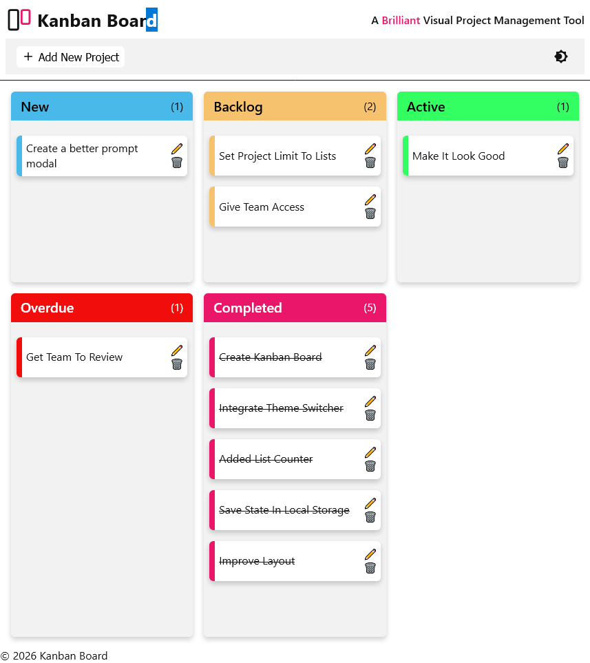

# Kanban Board - FCC

This is a Kanban Board project using HTML, CSS, and JS. Kanban Board is a brilliant visual tool that gives an overview of the current task/work status.

# Table of contents

- [Kanban Board - FCC](#kanban-board---fcc)
    - [Table of contents](#table-of-contents)
    - [Screenshot](#screenshot)
    - [My process](#my-process)
        - [Built with](#built-with)
    - [Resource](#resource)
    - [Author](#author)

## Screenshots

Using Kanban Board to list this projects tasks

Moved the various tasks to different lists

Light mode screenshot

And, of course, had to make it responsive

## My process

Like most projects, always start with the small wins. Create the basic HTML file. Style to a point where it looks okay, as one can make other tweaks along the way. For the script, started with:

1. The drag and drop functionality
1. Added list counter
1. Added list state by saving to localStorage
1. Added theme switcher
1. Create ability to add new projects/tasks
1. Added functionality to edit or delete tasks

### Built with

- Semantic HTML5 markup
- CSS custom properties
- CSS Grid & Flex
- Javascript

## Resource

- [HTML Drag and Drop API - MDN](https://developer.mozilla.org/en-US/docs/Web/API/HTML_Drag_and_Drop_API)

## Author

- [@davejnicol](https://github.com/davejnicol)
